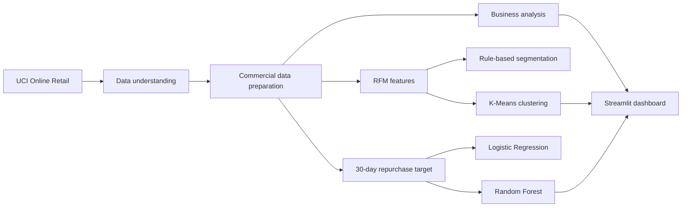

# Retail Intelligence ML

An end-to-end portfolio project that turns public retail transactions into commercial insights, customer segments, and repurchase propensity scores. The repository combines exploratory data analysis, business-oriented data preparation, RFM analysis, unsupervised learning, supervised learning, and an interactive Streamlit dashboard.

> This is a demonstration project built with public data. Production models require adaptation to each organization's data, processes, objectives, costs, and governance requirements.

## Dashboard preview

The deployed application presents three views:

1. **Commercial overview** — revenue, orders, customers, products, average order value, monthly revenue, product rankings, and country performance.
2. **Customer segmentation** — K-Means profiles, revenue contribution, average RFM behavior, and customer-level filters.
3. **Repurchase propensity** — Random Forest metrics, probability tiers, customer prioritization, and detailed result tables.

<!-- Add a screenshot after deployment, for example: docs/images/dashboard-overview.png -->

## Key capabilities

- Diagnoses missing values, duplicates, cancellations, negative quantities, zero prices, stock movements, and accounting adjustments.
- Produces a clean commercial sales table without silently discarding ambiguous records.
- Calculates revenue, order volume, customer volume, product volume, and average order value.
- Analyzes monthly performance, products, countries, weekdays, and transaction hours.
- Builds RFM features and business-rule customer segments.
- Applies K-Means clustering after logarithmic transformation and standardization.
- Frames repurchase as a supervised 30-day classification problem.
- Compares a majority-class baseline, logistic regression, and Random Forest.
- Exports prepared datasets and model artifacts for reuse by the dashboard.

## Project flow



## Commercial analysis

The preparation stage separates commercial sales from cancellations, internal stock movements, zero-value movements, and accounting adjustments. Fully identical records are inspected before being treated as technical duplicates.

The dashboard includes total revenue, unique orders, identified customers, unique products, average order value, monthly revenue evolution, product rankings, and revenue by country.

## RFM and K-Means segmentation

RFM converts the transaction table into one row per customer:

- **Recency:** days since the latest purchase;
- **Frequency:** number of unique orders;
- **Monetary:** total customer revenue.

The project compares interpretable business rules with K-Means clustering. Before the final clustering step, skewed RFM variables are transformed with `log1p` and standardized.

| Segment | Customers | Approx. revenue share |
|---|---:|---:|
| High value / VIP | 713 | 64.89% |
| Regular / Intermediate | 1,166 | 23.64% |
| Inactive / Lost | 1,622 | 6.22% |
| Recent / Low engagement | 837 | 5.25% |

## Repurchase propensity

A 30-day holdout window is used to label whether each historical customer purchased again. The feature table includes recency, frequency, monetary value, average order value, distinct products, and customer tenure.

Models compared:

- majority-class baseline;
- logistic regression with feature scaling and balanced class weights;
- Random Forest with balanced class weights.

Random Forest test results:

| Metric | Result |
|---|---:|
| Accuracy | ~71.1% |
| Precision | ~56.6% |
| Recall | ~63.4% |
| F1-score | ~59.8% |
| ROC-AUC | ~74.5% |

The probabilities are converted into **High**, **Medium**, and **Low** propensity tiers for portfolio prioritization. These scores are decision-support signals, not guarantees of future purchases.

## Technology stack

- Python
- pandas and NumPy
- Matplotlib
- scikit-learn
- joblib
- Jupyter Notebook
- Streamlit

## Repository structure

```text
retail-intelligence-ml/
├── .streamlit/
│   └── config.toml
├── data/
│   ├── vendas_limpas.csv.gz
│   ├── segmentacao_clientes.csv
│   └── resultado_propensao.csv
├── models/
│   ├── modelo_recompra_rf.pkl
│   └── features_recompra.pkl
├── notebooks/
│   ├── 01_entendimento_dados.ipynb
│   └── 03_previsao_recompra.ipynb
├── app.py
├── requirements.txt
├── requirements-notebooks.txt
├── .gitignore
└── README.md
```

The original Excel file and the uncompressed intermediate sales CSV are intentionally excluded from Git. The Streamlit app reads the equivalent compressed `vendas_limpas.csv.gz` file to reduce repository size and deployment startup overhead.

## Dataset

The project uses the public [Online Retail dataset from the UCI Machine Learning Repository](https://archive.ics.uci.edu/dataset/352/online-retail), created by Daqing Chen. It contains transactions from a UK-based non-store retailer between December 2010 and December 2011.

> Chen, D. (2015). *Online Retail* [Dataset]. UCI Machine Learning Repository. https://doi.org/10.24432/C5BW33

The UCI page lists the dataset under the Creative Commons Attribution 4.0 license.

## Run locally

### 1. Clone the repository

```bash
git clone https://github.com/AnandaFigueiredo/retail-intelligence-ml.git
cd retail-intelligence-ml
```

### 2. Create and activate a virtual environment

```bash
python -m venv .venv
```

Windows PowerShell:

```powershell
.\.venv\Scripts\Activate.ps1
```

macOS or Linux:

```bash
source .venv/bin/activate
```

### 3. Install dependencies

For the production dashboard:

```bash
python -m pip install -r requirements.txt
```

For notebook development:

```bash
python -m pip install -r requirements-notebooks.txt
```

### 4. Start the dashboard

```bash
streamlit run app.py
```

## Deploy on Streamlit Community Cloud

1. Push the repository to GitHub.
2. Open [Streamlit Community Cloud](https://share.streamlit.io/).
3. Create an app from `AnandaFigueiredo/retail-intelligence-ml`.
4. Select the `main` branch and set the entry point to `app.py`.
5. Deploy. No application secrets are required.

## Limitations

- The data covers approximately one year, limiting reliable annual seasonality and long-horizon forecasting.
- Repurchase labels depend on a single 30-day observation window.
- The customer split is stratified but not a repeated temporal backtest.
- The source does not include promotions, inventory availability, acquisition channels, margins, or campaign costs.
- Customer segmentation and propensity thresholds require business validation before operational use.
- The dashboard uses precomputed results and does not retrain models at runtime.

## Responsible use

This repository demonstrates Data Science and Machine Learning techniques with public data. It must not be treated as a production decision system without validation, monitoring, privacy controls, bias assessment, and adaptation to the organization's real operating context.
