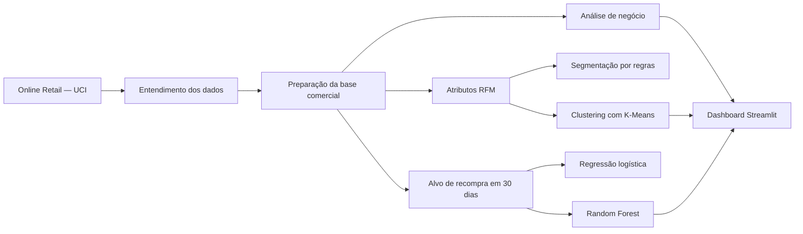

# Retail Intelligence ML

Projeto de portfólio end-to-end que transforma transações públicas de varejo em análises comerciais, segmentos de clientes e probabilidades de recompra. O repositório combina análise exploratória de dados, preparação orientada ao negócio, análise RFM, aprendizado não supervisionado, aprendizado supervisionado e um dashboard interativo desenvolvido com Streamlit.

**[Acesse a aplicação publicada no Streamlit](https://retail-intelligence-ml-jjpxjfr9mwegrcrxjvc3bq.streamlit.app/)**

> Este é um projeto demonstrativo construído com dados públicos. Modelos utilizados em produção exigem adaptação aos dados, processos, objetivos, custos e requisitos de governança de cada organização.

## Prévia do dashboard

A aplicação apresenta três áreas:

1. **Visão geral comercial** — faturamento, pedidos, clientes, produtos, ticket médio, evolução mensal da receita, rankings de produtos e desempenho por país.
2. **Segmentação de clientes** — perfis do K-Means, participação na receita, comportamento RFM médio e filtros por cliente.
3. **Propensão de recompra** — métricas da Random Forest, faixas de probabilidade, priorização de clientes e tabelas detalhadas.

## Principais funcionalidades

- Diagnóstico de valores ausentes, duplicatas, cancelamentos, quantidades negativas, preços zerados, movimentações de estoque e ajustes contábeis.
- Criação de uma base comercial limpa sem descartar silenciosamente registros ambíguos.
- Cálculo de faturamento, quantidade de pedidos, clientes, produtos e ticket médio.
- Análises mensais, por produto, país, dia da semana e horário.
- Construção de atributos RFM e segmentos definidos por regras de negócio.
- Aplicação do K-Means após transformação logarítmica e padronização.
- Formulação da recompra como um problema de classificação supervisionada em uma janela de 30 dias.
- Comparação entre baseline da classe majoritária, regressão logística e Random Forest.
- Exportação de bases preparadas e artefatos dos modelos para reutilização pelo dashboard.

## Fluxo do projeto



## Análise comercial

A preparação separa as vendas comerciais dos cancelamentos, movimentações internas de estoque, movimentações sem valor financeiro e ajustes contábeis. Registros completamente idênticos são inspecionados antes de serem tratados como duplicações técnicas.

O dashboard apresenta faturamento total, pedidos únicos, clientes identificados, produtos únicos, ticket médio, evolução mensal da receita, rankings de produtos e faturamento por país.

## Segmentação RFM e K-Means

A análise RFM transforma a tabela de transações em uma base com uma linha por cliente:

- **Recency (recência):** quantidade de dias desde a última compra;
- **Frequency (frequência):** número de pedidos únicos;
- **Monetary (valor monetário):** faturamento total do cliente.

O projeto compara regras de negócio interpretáveis com a segmentação por K-Means. Antes da etapa final de clustering, as variáveis RFM assimétricas são transformadas com `log1p` e padronizadas.

| Segmento | Clientes | Participação aproximada na receita |
|---|---:|---:|
| Alto valor / VIP | 713 | 64,89% |
| Regulares / Intermediários | 1.166 | 23,64% |
| Inativos / Perdidos | 1.622 | 6,22% |
| Recentes / Baixo engajamento | 837 | 5,25% |

## Propensão de recompra

Uma janela futura de 30 dias é utilizada para identificar se cada cliente histórico realizou uma nova compra. A base de atributos inclui recência, frequência, valor monetário, ticket médio, quantidade de produtos distintos e tempo de relacionamento.

Modelos comparados:

- baseline da classe majoritária;
- regressão logística com padronização e pesos balanceados;
- Random Forest com pesos balanceados.

Resultados da Random Forest no conjunto de teste:

| Métrica | Resultado |
|---|---:|
| Acurácia | ~71,1% |
| Precisão | ~56,6% |
| Recall | ~63,4% |
| F1-score | ~59,8% |
| ROC-AUC | ~74,5% |

As probabilidades são convertidas nas faixas de propensão **Alta**, **Média** e **Baixa** para auxiliar na priorização da carteira. Essas pontuações são sinais de apoio à decisão, não garantias de compras futuras.

## Tecnologias utilizadas

- Python
- pandas e NumPy
- Matplotlib
- scikit-learn
- joblib
- Jupyter Notebook
- Streamlit

## Estrutura do repositório

```text
retail-intelligence-ml/
├── .streamlit/
│   └── config.toml
├── data/
│   ├── vendas_limpas.csv.gz
│   ├── segmentacao_clientes.csv
│   └── resultado_propensao.csv
├── models/
│   ├── modelo_recompra_rf.pkl
│   └── features_recompra.pkl
├── notebooks/
│   ├── 01_entendimento_dados.ipynb
│   └── 03_previsao_recompra.ipynb
├── app.py
├── requirements.txt
├── requirements-notebooks.txt
├── .gitignore
└── README.md
```

O arquivo Excel original e o CSV intermediário descomprimido não são versionados. A aplicação Streamlit utiliza o arquivo equivalente `vendas_limpas.csv.gz`, reduzindo o tamanho do repositório e o tempo necessário para o deploy.

## Dataset

O projeto utiliza o dataset público [Online Retail, do UCI Machine Learning Repository](https://archive.ics.uci.edu/dataset/352/online-retail), criado por Daqing Chen. A base contém transações de um varejista online britânico entre dezembro de 2010 e dezembro de 2011.

> Chen, D. (2015). *Online Retail* [Dataset]. UCI Machine Learning Repository. https://doi.org/10.24432/C5BW33

A página do UCI disponibiliza o dataset sob a licença Creative Commons Attribution 4.0.

## Execução local

### 1. Clone o repositório

```bash
git clone https://github.com/AnandaFigueiredo/retail-intelligence-ml.git
cd retail-intelligence-ml
```

### 2. Crie e ative um ambiente virtual

```bash
python -m venv .venv
```

Windows PowerShell:

```powershell
.\.venv\Scripts\Activate.ps1
```

macOS ou Linux:

```bash
source .venv/bin/activate
```

### 3. Instale as dependências

Para executar o dashboard em produção:

```bash
python -m pip install -r requirements.txt
```

Para trabalhar também com os notebooks:

```bash
python -m pip install -r requirements-notebooks.txt
```

### 4. Inicie o dashboard

```bash
streamlit run app.py
```

## Aplicação publicada

O dashboard está disponível publicamente no Streamlit Community Cloud:

**[Abrir o Retail Intelligence ML](https://retail-intelligence-ml-jjpxjfr9mwegrcrxjvc3bq.streamlit.app/)**

O deploy utiliza a branch `main` deste repositório e o arquivo `app.py` como ponto de entrada. A aplicação não utiliza secrets.

## Limitações

- Os dados abrangem aproximadamente um ano, limitando a avaliação da sazonalidade anual e previsões de longo prazo.
- Os rótulos de recompra dependem de uma única janela futura de 30 dias.
- A divisão de clientes é estratificada, mas não utiliza backtesting temporal repetido.
- A fonte não contém promoções, disponibilidade de estoque, canais de aquisição, margens ou custos de campanha.
- Os segmentos e thresholds de propensão exigem validação de negócio antes do uso operacional.
- O dashboard utiliza resultados previamente calculados e não retreina os modelos durante a execução.

## Uso responsável

Este repositório demonstra técnicas de Ciência de Dados e Machine Learning com dados públicos. Ele não deve ser tratado como um sistema de decisão em produção sem validação, monitoramento, controles de privacidade, avaliação de vieses e adaptação ao contexto operacional real da organização.
