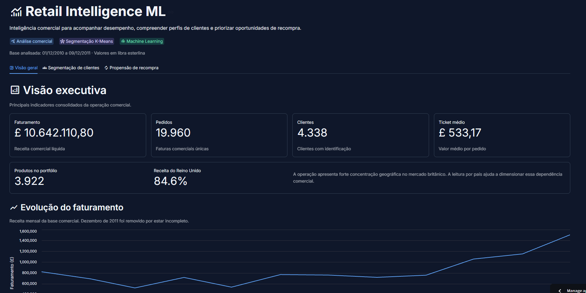
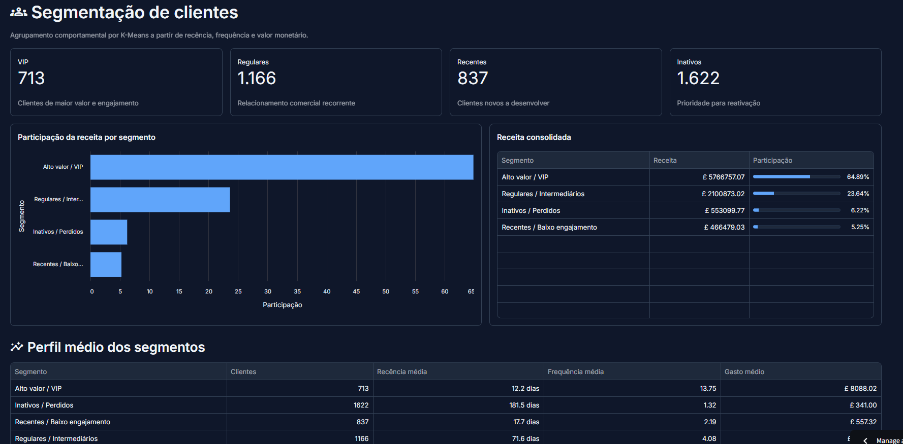
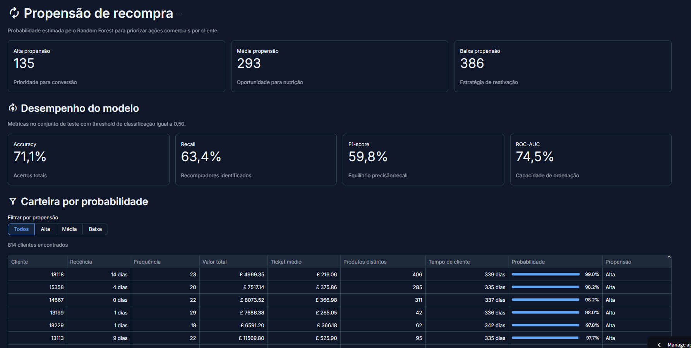
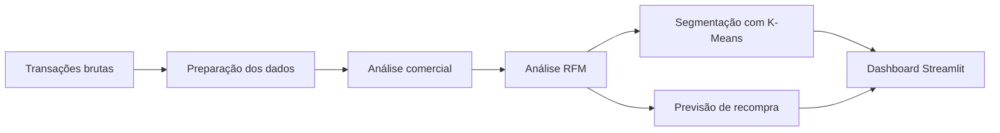

# Retail Intelligence ML

> Projeto completo de análise de varejo e aprendizado de máquina, com foco em inteligência de clientes, segmentação e previsão de recompra.

[](https://www.python.org/)
[](https://scikit-learn.org/)
[](https://retail-intelligence-ml-jjpxjfr9mwegrcrxjvc3bq.streamlit.app/)

Projeto de portfólio que transforma transações de varejo em inteligência comercial. O trabalho cobre entendimento e preparação dos dados, análise RFM, segmentação de clientes com K-Means, previsão de recompra com Random Forest e entrega dos resultados em uma aplicação Streamlit.

**Tecnologias:** Python · pandas · NumPy · scikit-learn · Jupyter · Streamlit

**Destaques:** ROC-AUC de 74,5% · recall de 63,4% · 64,89% da receita concentrada no segmento VIP

## Demonstração online

**[Acessar o dashboard Retail Intelligence ML](https://retail-intelligence-ml-jjpxjfr9mwegrcrxjvc3bq.streamlit.app/)**

A aplicação reúne visão comercial, segmentação de clientes e propensão de recompra. O deploy utiliza a branch `main` e o arquivo `app.py` como ponto de entrada.

## Capturas do dashboard

### Visão geral



### Segmentação de clientes



### Propensão de recompra



## Principais resultados

### Random Forest — previsão de recompra

| Métrica | Resultado |
|---|---:|
| Acurácia | 71,1% |
| Precisão | 56,6% |
| Recall (sensibilidade) | 63,4% |
| F1-score | 59,8% |
| ROC-AUC | 74,5% |

### K-Means — segmentação de clientes

| Segmento | Clientes | Participação na receita |
|---|---:|---:|
| Alto valor / VIP | 713 | 64,89% |
| Regulares / Intermediários | 1.166 | 23,64% |
| Recentes / Baixo engajamento | 837 | 5,25% |
| Inativos / Perdidos | 1.622 | 6,22% |

## Principais insights de negócio

- Aproximadamente 65% da receita está concentrada no grupo VIP.
- A frequência de compra foi a variável mais importante para prever recompra.
- O modelo identificou aproximadamente 63% dos clientes que efetivamente recompraram.
- O Reino Unido concentra aproximadamente 84,6% da receita da base comercial.
- Clientes de alto valor e clientes inativos exigem estratégias distintas: retenção e relacionamento para VIPs; reativação seletiva para inativos.

## Aprendizado de máquina

### Segmentação de clientes

As variáveis RFM — recência, frequência e valor monetário — foram transformadas com `log1p` e padronizadas antes do K-Means. Os clusters foram interpretados e convertidos em quatro perfis comerciais acionáveis.

### Previsão de recompra

O problema supervisionado estima se um cliente voltará a comprar em uma janela futura de 30 dias. Foram comparados baseline da classe majoritária, regressão logística e Random Forest. As probabilidades do modelo final são apresentadas como propensão alta, média ou baixa para apoiar a priorização comercial.

### Decisões de modelagem

Também foram testadas previsões de faturamento diário e semanal com Random Forest, HistGradientBoosting e regressão linear. Esses modelos não superaram uma baseline sazonal simples.

Em vez de forçar um modelo inadequado, o problema foi reformulado como previsão de recompra. A decisão preserva um resultado negativo relevante e demonstra avaliação crítica: a escolha do modelo e do problema foi orientada pelo desempenho observado, não pela complexidade do algoritmo.

## Fluxo do projeto



## Estrutura do projeto

```text
retail-intelligence-ml/
├── .streamlit/
│   └── config.toml
├── data/
│   ├── vendas_limpas.csv.gz
│   ├── segmentacao_clientes.csv
│   └── resultado_propensao.csv
├── docs/
│   └── images/
│       └── README.md
├── models/
│   ├── modelo_recompra_rf.pkl
│   └── features_recompra.pkl
├── notebooks/
│   ├── 01_entendimento_dados.ipynb
│   └── 03_previsao_recompra.ipynb
├── app.py
├── requirements.txt
├── requirements-notebooks.txt
└── README.md
```

- `notebooks/01_entendimento_dados.ipynb`: entendimento, qualidade e preparação da base comercial.
- `notebooks/03_previsao_recompra.ipynb`: RFM, clustering, experimentos de previsão e modelo de recompra.
- `app.py`: aplicação Streamlit que consome dados e resultados previamente preparados.
- `models/`: modelo final e lista de atributos usados na previsão.

## Instalação

```bash
git clone https://github.com/AnandaFigueiredo/retail-intelligence-ml.git
cd retail-intelligence-ml
python -m venv .venv
```

Ative o ambiente virtual:

```powershell
# Windows PowerShell
.\.venv\Scripts\Activate.ps1
```

```bash
# macOS ou Linux
source .venv/bin/activate
```

Instale e execute o dashboard:

```bash
python -m pip install -r requirements.txt
streamlit run app.py
```

Para executar também os notebooks:

```bash
python -m pip install -r requirements-notebooks.txt
```

## Conjunto de dados

O projeto utiliza o [Online Retail — UCI Machine Learning Repository](https://archive.ics.uci.edu/dataset/352/online-retail), com transações de um varejista online britânico entre dezembro de 2010 e dezembro de 2011.

> Chen, D. (2015). *Online Retail* [Dataset]. UCI Machine Learning Repository. https://doi.org/10.24432/C5BW33

O Excel original não é versionado. O dashboard utiliza uma base comercial comprimida e os resultados derivados necessários ao funcionamento da aplicação.

## Aprendizados

- Uma baseline simples é indispensável para saber se a complexidade adicional realmente gera valor.
- A separação temporal entre atributos e alvo ajuda a prevenir data leakage.
- Acurácia isolada é insuficiente em classes desbalanceadas; recall, precisão, F1-score e ROC-AUC oferecem uma avaliação mais completa.
- Clusters precisam ser interpretados no contexto do negócio para se tornarem segmentos úteis.
- Um modelo só se torna utilizável quando seus resultados são traduzidos em uma interface clara e acionável.

## Limitações

- A base cobre aproximadamente um ano, o que limita a análise de sazonalidade anual e previsões de longo prazo.
- O alvo de recompra utiliza uma única janela futura de 30 dias.
- A avaliação não inclui backtesting temporal repetido.
- O dataset não contém promoções, estoque, margens, custos de campanha ou canais de aquisição.
- Segmentos e faixas de propensão precisam de validação antes de qualquer uso operacional.
- O dashboard apresenta resultados previamente calculados e não retreina os modelos durante a execução.

## Uso responsável

Este é um projeto demonstrativo com dados públicos. Um uso em produção exigiria validação no contexto real, monitoramento, governança, controles de privacidade e avaliação contínua de desempenho e vieses.

## Links

- [Aplicação Streamlit](https://retail-intelligence-ml-jjpxjfr9mwegrcrxjvc3bq.streamlit.app/)
- [Conjunto de dados Online Retail — UCI](https://archive.ics.uci.edu/dataset/352/online-retail)
- [Código-fonte no GitHub](https://github.com/AnandaFigueiredo/retail-intelligence-ml)
